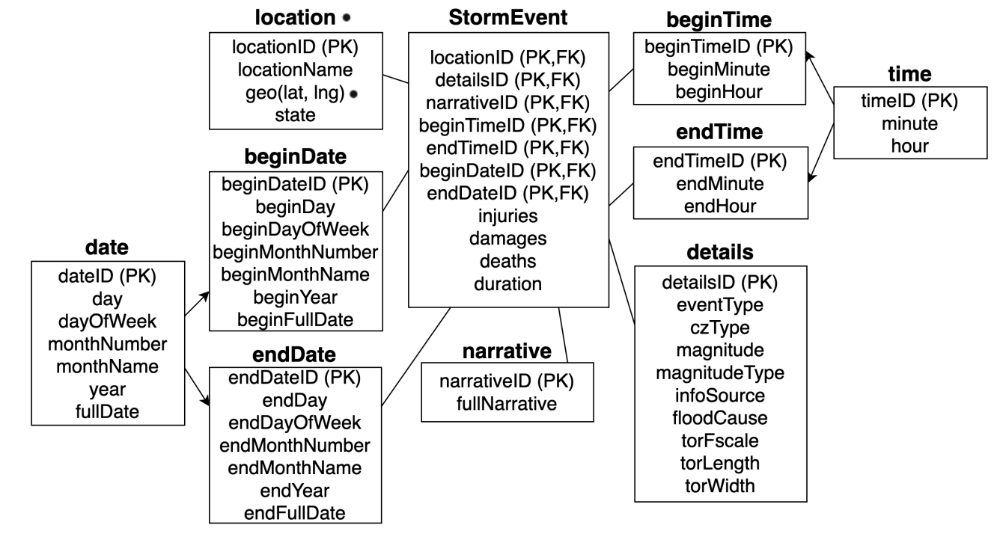
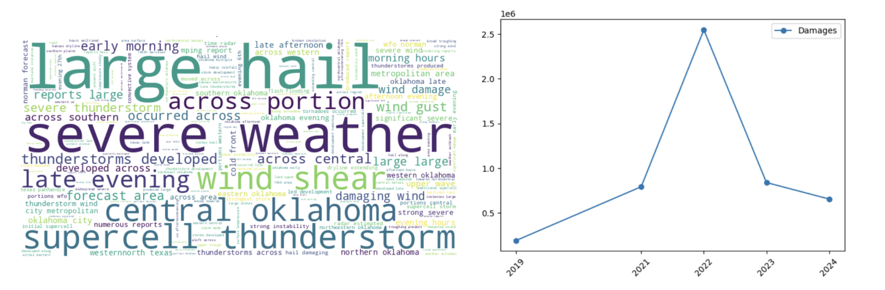
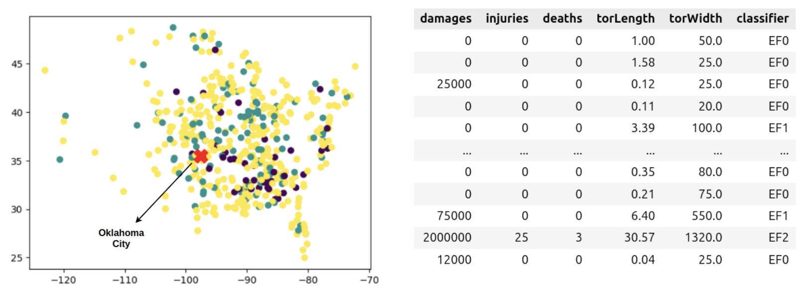

## Storm Event Data Unit Mining

This project involves proposing operators for a SQL-like language to facilitate data analytics in relational databases.

This repository presents the first step towards this goal, which is the underlying Python ETL for generating the expected results.

### Operations

We implement the following ML models and data science tasks:

1. Classification
   a. kNN Classifier
   b. Decision Tree
   c. Linear Regression

2. Clustering
   a. DBScan
   b. kMeans

3. Similarity Searchs
   a. kNN to retrieve the top-k most similar results
   b. RANGE to retrieve the most similar results within a threshold
   c. Both operators are capable of working with multiple data formats, such as spatial data, temporal data, textual and numerical.
   d. We used NLP techniques (embeddings) for textual data and spatial distance measures like Haversine for spatial data.

5. Data visualization
     a. Every option available in the matplotlib

All of these were implemented using Python's libs such as scikit and matplotlib

### Case Study

We used the NOAA Storm Event Database, available at X. Then, we performed ETL for cleaning and enhancing the data, modelling it as a star-schema, depicted in the following figure.

Some of the ETL we performed are:

* Structured the dataset into a star schema in a data warehouse to support efficient analytical queries, following Kimball’s dimensional modeling principles.
* Extracted and organized raw storm event data into multiple dimension tables (e.g., location, date, time, narrative) and a central fact table (StormEvent).
* Used views for role-playing dimensions, like beginDate/endDate and beginTime/endTime, derived from physical date and time tables.
* Mapped schema tables to semantic roles: location ↔ event position, time/date ↔ event time, narrative/details ↔ event mention.
* Performed preprocessing tasks, such as converting damage values to numeric format, merging narrative descriptions, and formatting dates to ISO 8601.

Then, we performed the following queries:

1. aggregates data from climate events that have occurred since 2019 within a 300-kilometer perimeter around Oklahoma City, an area often known as Tornado Alley. This query uses a similarity range function to find narratives semantically related to the following sentence: ``flash flood, heavy rain, floods''. The results are depicted in the following figures

3. analyze tornado events across the United States using two machine learning techniques: clustering and classification. The scatter plot of referring to the first query visualization, shows the spatial distribution of tornado occurrences using a K-Means model trained on attributes such as scale, length, and width, revealing a noticeable concentration of events in the Tornado Alley area. Furthermore, the distribution of clusters across the map indicates that different geographic regions tend to experience tornadoes with distinct physical profiles, suggesting a potential link between location and tornado characteristics.

The right figure which shows the outcome of applying a KNN classifier to categorize tornado events according to the Enhanced Fujita Scale. The table includes a new column, `classifier', which contains the predicted classification. This result highlights how the proposed approach can be leveraged to enrich analysis by inferring missing information or generating new attributes based on patterns in the data.

